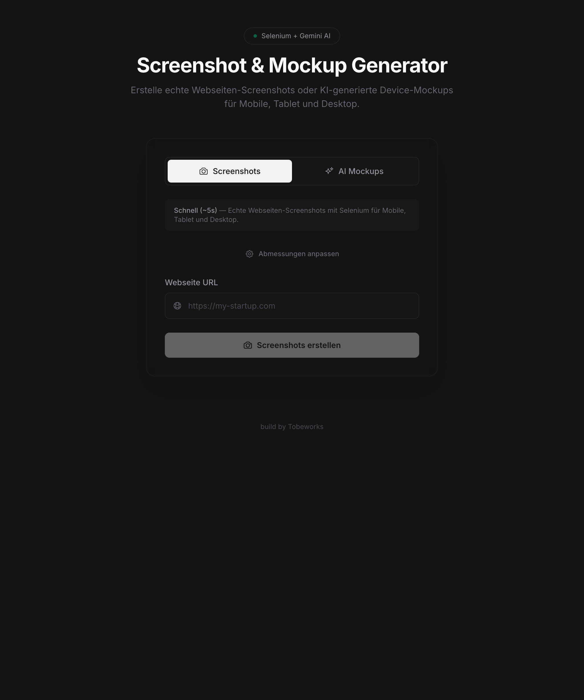

# Mockup Generator

A modern web tool for creating website screenshots and AI-generated device mockups for Mobile, Tablet, and Desktop.



## 🚀 Features

### 1. Two Generation Modes

#### Screenshots (Fast)
- **Speed:** ~5 seconds
- **Technology:** Selenium WebDriver
- **Description:** Creates real website screenshots in three resolutions (Mobile, Tablet, Desktop)
- **Ideal for:** Quick visualization of live websites

#### AI Mockups (AI-generated)
- **Speed:** ~60 seconds
- **Technology:** Google Gemini AI
- **Description:** Generates realistic device mockups with iPhone, iPad, and MacBook frames
- **Special feature:** Uses a "vision" description for custom results
- **Ideal for:** Presentations and design reviews

### 2. Extensive Device Support

#### Mobile (16 devices)
- iPhone SE (1st & 3rd Gen)
- iPhone 4/4s, 5/5s
- iPhone 6/7/8, iPhone X/XS/11 Pro
- iPhone 12/13/14/15/16 Series
- iPhone 16 Pro
- Samsung Galaxy S5-S24 Ultra
- Google Pixel 7/8/9 Pro
- Generic Android devices

#### Tablet (9 devices)
- iPad Mini (all generations)
- iPad (1st - 9th Gen) / iPad Air
- iPad Pro 11" & 12.9"
- Nexus 7, Samsung Galaxy Tab Series
- Samsung Galaxy Tab S9 Ultra

#### Desktop (9 devices)
- Old Monitor (4:3)
- Legacy Laptop / Projector
- Budget Laptop (15.6")
- MacBook Air 13" (Intel/M1/M2)
- MacBook Pro 14"
- Standard Monitor (FHD 1920x1080)
- Ultrawide Monitor (WFHD)
- QHD Monitor / 27" iMac
- 4K Monitor (Native/Unscaled)

### 3. Custom Dimensions

- **Predefined devices:** Dropdown selection for each device
- **Custom values:** Manual width/height input
- **Persistent storage:** Settings are saved in LocalStorage
- **Reset:** Default values can be restored at any time

### 4. Advanced UI Features

#### Image Viewer (Lightbox)
- **Full-screen view:** Click on an image to open the lightbox
- **Navigation:** Arrow keys (← →) for previous/next
- **Zoom:** Click on the image to zoom
- **Close:** Esc key or click on background
- **Download:** Download each image individually

#### Download Features
- **Single download:** Each image has a download button
- **Naming convention:** `hostname_mode_device.png` (e.g., `google_com_screenshot_mobile.png`)
- **Batch download:** Download images one by one

#### Status Display
- **Loading time:** Real-time counter during generation
- **Status messages:** Context-aware progress messages
- **Progress bar:** Visual progress indicator

### 5. Technical Details

#### Frontend
- **Framework:** Vue 3 with Composition API (`<script setup>`)
- **Language:** TypeScript
- **Styling:** Tailwind CSS 4.1
- **Build tool:** Vite 7.2
- **HTTP client:** Axios

#### Backend Communication
- **API endpoint:** `http://localhost:5001/api`
- **Endpoints:** `/api/screenshots`, `/api/mockups`
- **Timeouts:** Screenshots (60s), Mockups (300s)
- **Error handling:** Comprehensive error messages for network and server errors

#### Image Storage
- **Local storage:** Images are kept in the browser as Data URLs
- **LocalStorage:** Device settings are persisted
- **Session:** Generated results remain until restart

## 📋 Requirements

### Backend
The tool requires a running backend at `http://localhost:5001` with the following endpoints:

- `POST /api/screenshots` - Creates screenshots of a website
- `POST /api/mockups` - Generates AI mockups with Gemini AI

Backend parameters:
- `url` (required): The website to render
- `user_instruction` (optional): Description for AI mockups
- `mobile_width`, `mobile_height`: Mobile resolution
- `tablet_width`, `tablet_height`: Tablet resolution
- `desktop_width`, `desktop_height`: Desktop resolution

### Frontend
- Node.js 18+ (for Vite)
- pnpm (recommended) or npm

## 🚀 Installation & Start

```bash
# Install dependencies
pnpm install

# Start development server
pnpm dev

# Build for production
pnpm build

# Preview the build
pnpm preview
```

## 📁 Project Structure

```
mockup_generator/
├── src/
│   ├── components/
│   │   ├── ImageLightbox.vue      # Lightbox for image viewing
│   │   ├── MockupGrid.vue         # Grid display of results
│   │   ├── MockupInput.vue        # Input form
│   │   └── SettingsModal.vue      # Settings modal
│   ├── composables/
│   │   ├── useGeneratorApi.ts     # API logic for generation
│   │   └── useDeviceSettings.ts   # Device settings
│   ├── constants/
│   │   └── devices.ts             # Device definitions
│   ├── App.vue                    # Main component
│   └── main.ts                    # Entry point
├── docs/
│   └── screen.png                 # App screenshot
├── public/
│   └── vite.svg                   # Vite logo
├── index.html
├── package.json
├── tsconfig.json
└── vite.config.ts
```

## 🛠️ Development

### Adding new devices
Edit [`src/constants/devices.ts`](src/constants/devices.ts):

```typescript
{
  name: 'New device',
  viewport: { width: 1234, height: 5678 }
}
```

### Adjusting API endpoints
Edit [`src/composables/useGeneratorApi.ts`](src/composables/useGeneratorApi.ts:4):

```typescript
const BASE_URL = 'http://localhost:5001/api'
```

## 📝 License

MIT License - see [`LICENSE`](LICENSE) for details.

## 👤 Author

**Tobeworks**

---

*Built with Vue 3, TypeScript, and Tailwind CSS*
